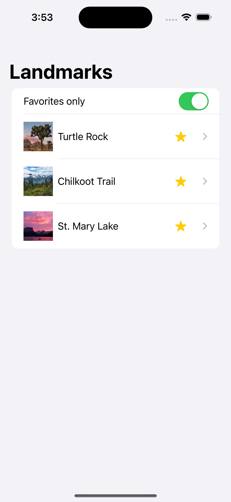
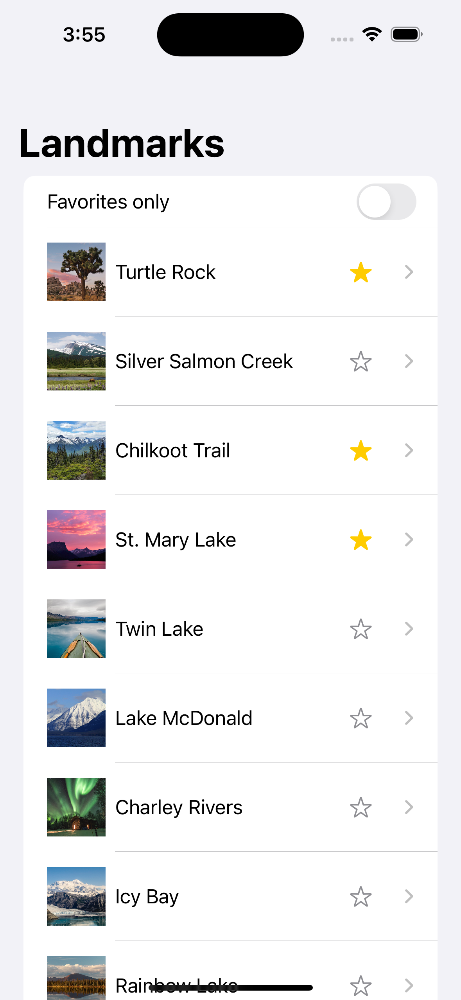
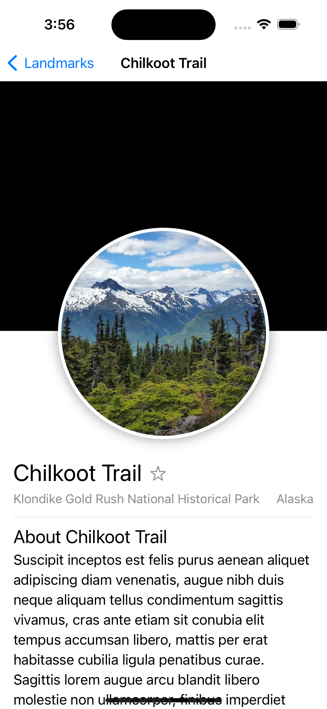
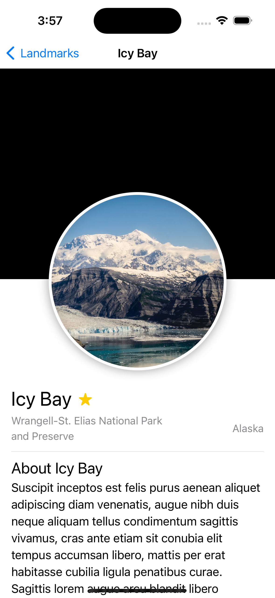

# Landmarks

The Landmarks app is a SwiftUI project that displays a list of landmarks and allows users to mark their favorite landmarks.

## Features

- Display a list of landmarks
- Mark landmarks as favorites
- View details of each landmark

## Screenshots

| Home Screen                           | Details Screen                          |
|---------------------------------------|-----------------------------------------|
|  |  |

| Favorites Screen                      | Another Screen                          |
|---------------------------------------|-----------------------------------------|
|  |  |

## Requirements

- iOS 16.0 or later
- Xcode 15.4

## Installation

Clone the repository:

```bash
git clone git@github.com:akramhusseini/Landmarks.git
